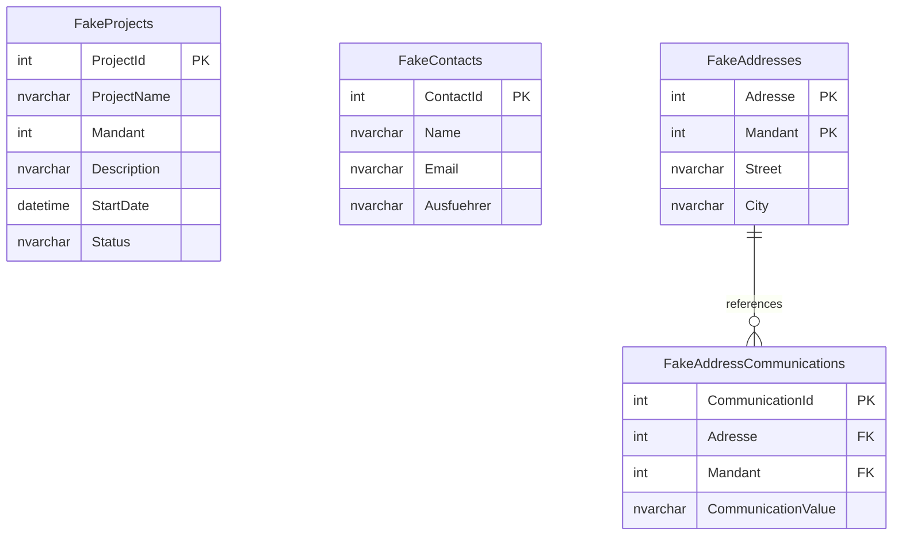

# Fictional Database Schema

This directory contains the SQL script (`01_fictional_schema.sql`) to set up the fictional database schema used in the integration and unit tests for the `SqlToAi` project.

## Schema Overview

The fictional schema replaces real ERP tables with generic counterparts to avoid dependencies on actual production ERP systems.

### Objects

1. **`dbo.FakeProjects`**
   - **Purpose:** Replaces `dbo.BCSPjmProjekte`. Contains project meta-information.
   - **Key Fields:** `ProjectId` (PK), `ProjectName`, `Mandant` (Client/Tenant), `Status`.

2. **`dbo.vewFakeProjectList` (View)**
   - **Purpose:** Replaces `dbo.vewBCSPjmProjektliste`. Exposes project overview columns.

3. **`dbo.FakeContacts`**
   - **Purpose:** Replaces `dbo.BCSPjmAdressenKontakt` for anonymization checks (like checking PII scrambling).
   - **Key Fields:** `Name`, `Email`, `Ausfuehrer` (Executor).

4. **`dbo.FakeAddresses`**
   - **Purpose:** Replaces `dbo.KHKAdressen`. Part of the composite key constraint test.
   - **Key Fields:** `Adresse` (Address ID), `Mandant` (Client/Tenant) — Composite Primary Key.

5. **`dbo.FakeAddressCommunications`**
   - **Purpose:** Replaces `dbo.KHKAdressenBelegartenKommunikation`. Part of the composite key constraint test.
   - **Key Fields:** `CommunicationId` (PK), `Adresse`, `Mandant` (Composite Foreign Key referencing `dbo.FakeAddresses`).

6. **`dbo.spFakeSysTan` (Stored Procedure)**
   - **Purpose:** Replaces `dbo.spSysTan` for validating routine parameter inspection.
   - **Parameters:** `@TanType` (input), `@NextValue` (output).
